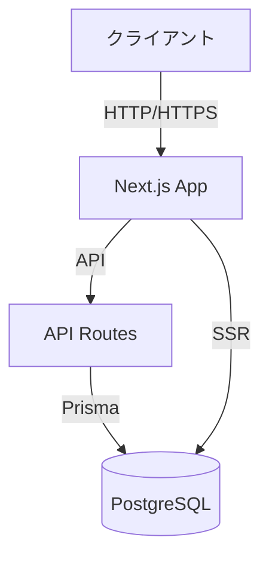
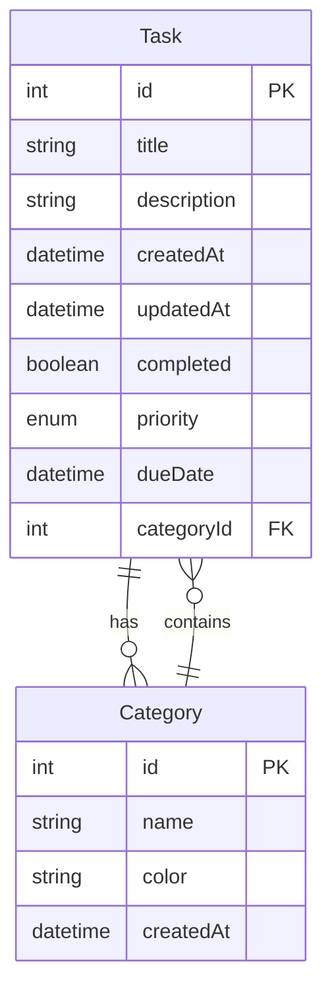
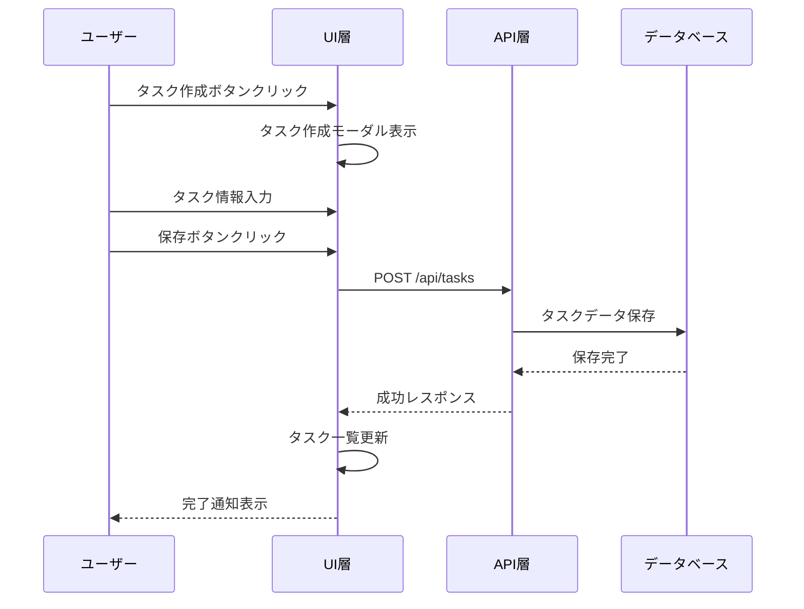
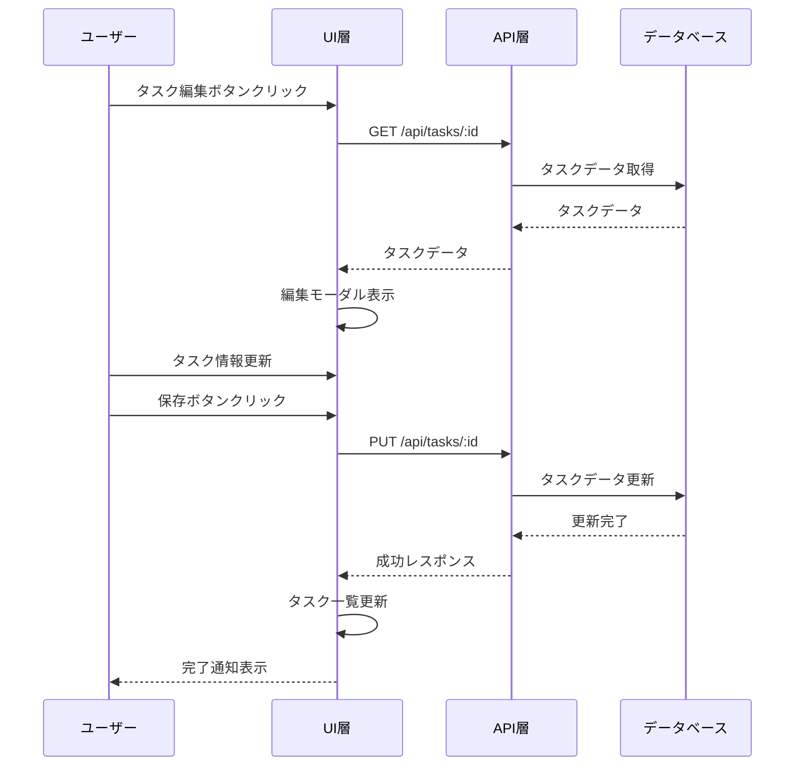
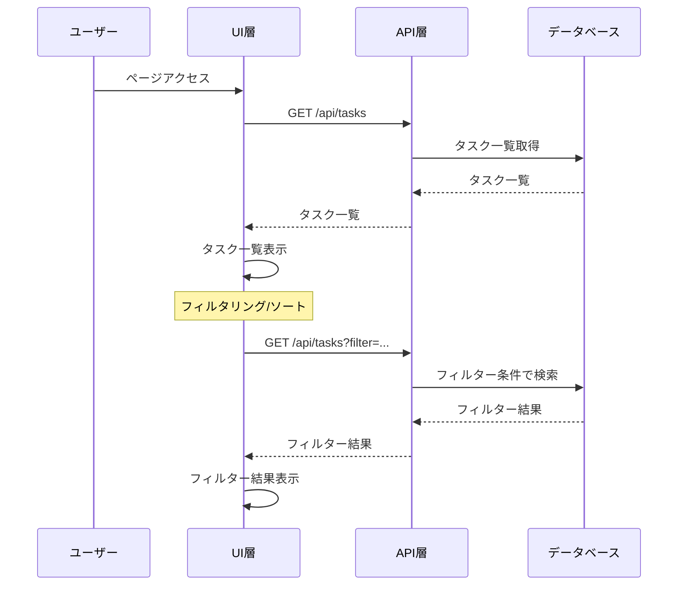
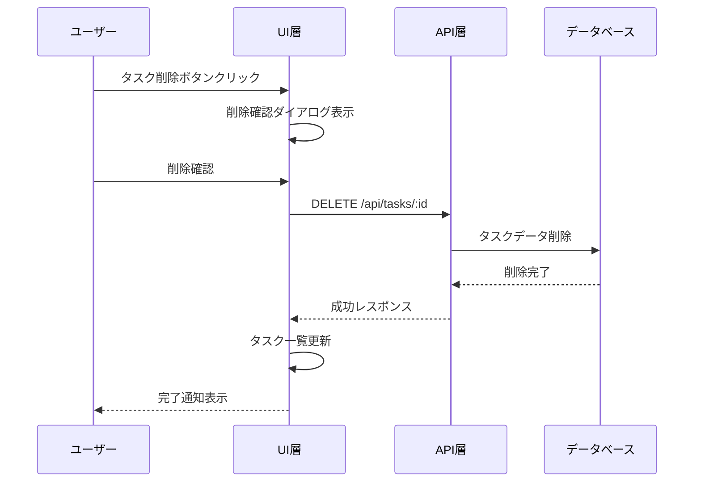
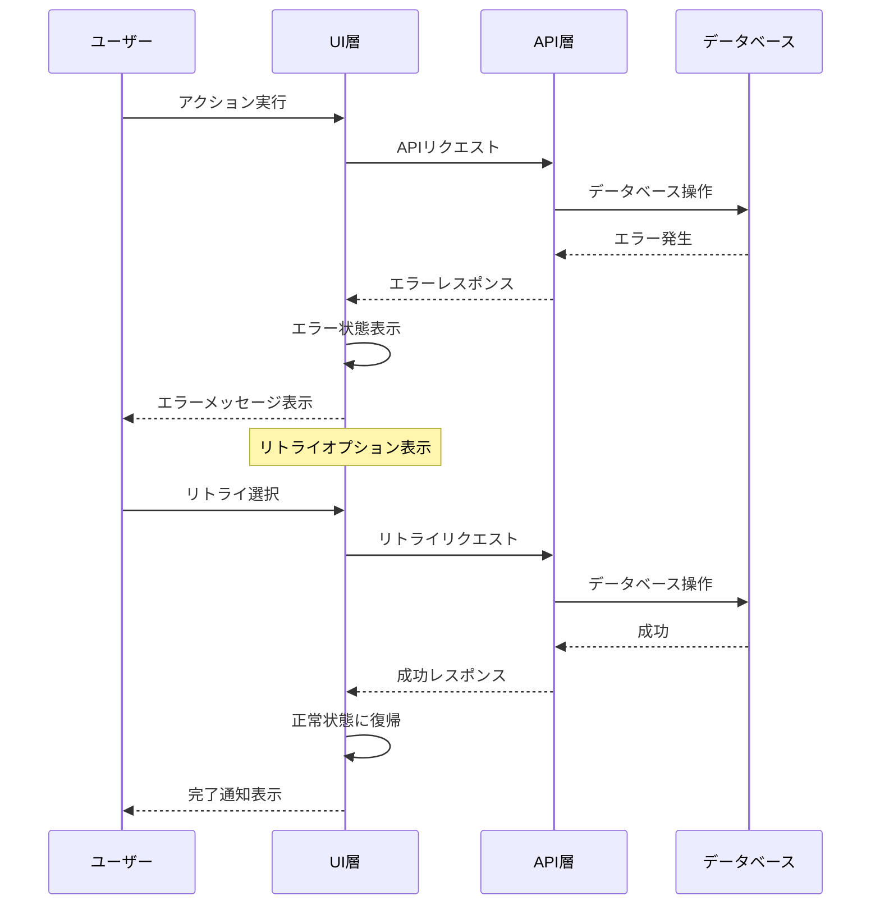

# TODOアプリケーション 要件定義書

## 1. システム概要

### 1.1 目的

ユーザーが日々のタスクを効率的に管理し、生産性を向上させるためのシンプルなTODOアプリケーションを提供します。

### 1.2 対象ユーザー

- 個人のタスク管理が必要な一般ユーザー
- シンプルで使いやすいインターフェースを求めるユーザー

## 2. 機能要件

### 2.1 必須機能

1. タスク管理機能
   - タスクの作成
   - タスクの編集
   - タスクの削除
   - タスクの完了/未完了の切り替え
   - タスクの一覧表示

2. タスクの属性
   - タイトル
   - 説明
   - 作成日時
   - 更新日時
   - 完了状態
   - 優先度（高/中/低）

### 2.2 オプション機能

1. タスクのカテゴリ分類
2. タスクの期限設定
3. タスクの検索機能
4. タスクのソート機能

## 3. システム構成

### 3.1 アーキテクチャ図

### 3.2 データベース設計

## 4. 非機能要件

### 4.1 性能要件

- ページロード時間: 2秒以内
- タスク操作のレスポンス: 1秒以内
- 同時接続ユーザー数: 100人以上

### 4.2 セキュリティ要件

- HTTPS通信の必須化
- 入力値のバリデーション
- XSS対策
- CSRF対策

### 4.3 可用性要件

- システム稼働率: 99.9%
- バックアップ: 日次
- 障害復旧時間: 4時間以内

## 5. 開発フェーズ

### 5.1 フェーズ1（MVP）

1. 基本的なCRUD操作の実装
2. シンプルなUIの実装
3. データベース設計と実装

### 5.2 フェーズ2

1. カテゴリ機能の追加
2. 検索機能の実装
3. UI/UXの改善

### 5.3 フェーズ3

1. パフォーマンス最適化
2. セキュリティ強化
3. テストの充実化

## 6. 成功基準

- ユーザーが直感的に操作できる
- レスポンスが速い
- データの整合性が保たれている
- セキュアな運用が可能

## 7. シーケンス図

### 7.1 タスク作成フロー

### 7.2 タスク更新フロー

### 7.3 タスク一覧取得フロー

### 7.4 タスク削除フロー

### 7.5 エラーハンドリングフロー

