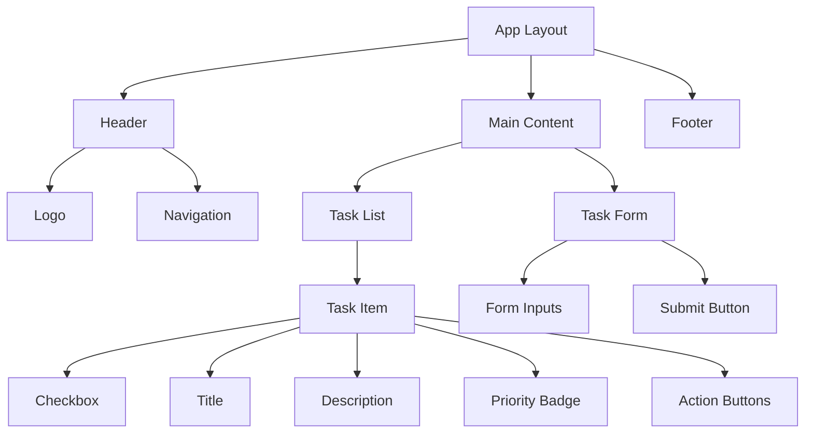
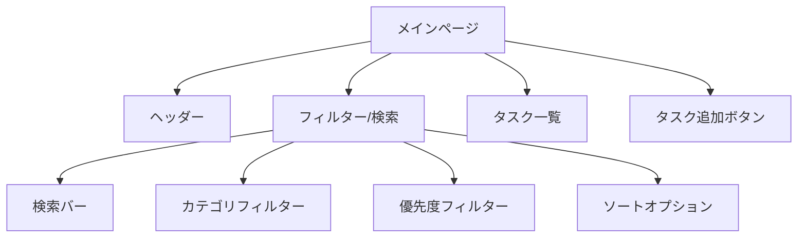
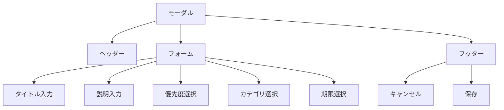
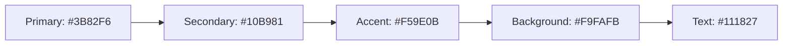

# TODOアプリケーション UI設計書

## 1. コンポーネント階層

## 2. ページ構成

### 2.1 メインページ（タスク一覧）

### 2.2 タスク作成/編集モーダル

## 3. コンポーネント詳細

### 3.1 共通コンポーネント

#### ヘッダー

- アプリケーションロゴ
- ナビゲーションメニュー
- ユーザー設定（オプション）

#### タスクアイテム

- チェックボックス（完了状態）
- タイトル
- 説明文
- 優先度バッジ
- アクションボタン（編集/削除）
- カテゴリタグ（オプション）
- 期限表示（オプション）

#### フォーム要素

- テキスト入力
- テキストエリア
- セレクトボックス
- チェックボックス
- 日付選択
- カラーピッカー（カテゴリ用）

### 3.2 レイアウト

#### デスクトップ

- ヘッダー: 固定
- メインコンテンツ: 2カラムレイアウト
  - 左: フィルター/検索
  - 右: タスク一覧
- フッター: 固定

#### モバイル

- ヘッダー: 固定
- メインコンテンツ: 1カラムレイアウト
  - フィルター/検索: スライドアップメニュー
  - タスク一覧: フルスクリーン
- フッター: 固定

## 4. デザインシステム

### 4.1 カラーパレット

### 4.2 タイポグラフィ

- 見出し: Inter
- 本文: Inter
- サイズ階層:
  - H1: 2rem
  - H2: 1.5rem
  - H3: 1.25rem
  - Body: 1rem
  - Small: 0.875rem

### 4.3 スペーシング

- 基本単位: 0.25rem
- コンポーネント間: 1rem
- セクション間: 2rem

## 5. インタラクション

### 5.1 アニメーション

- ページ遷移: フェード
- モーダル: スライドアップ
- リストアイテム: フェードイン
- ボタン: ホバーエフェクト

### 5.2 レスポンシブ動作

- ブレークポイント:
  - モバイル: < 640px
  - タブレット: 640px - 1024px
  - デスクトップ: > 1024px

## 6. アクセシビリティ

### 6.1 キーボード操作

- Tabキーによるフォーカス移動
- ショートカットキー
  - タスク追加: Ctrl/Cmd + N
  - 検索: Ctrl/Cmd + F
  - フィルター: Ctrl/Cmd + Shift + F

### 6.2 スクリーンリーダー対応

- ARIAラベル
- 適切な見出し階層
- フォーカス管理
- エラー状態の通知
